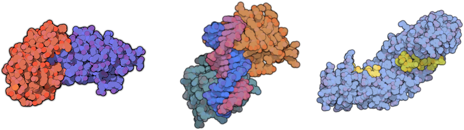

{: .align-center}




## Installation
[](https://pypi.org/project/lightdock/) [](https://travis-ci.com/lightdock/lightdock)

LightDock is distributed as a [PyPi package](https://pypi.org/project/lightdock/)!

```
pip install lightdock
```

For members of the [SBGrid](https://sbgrid.org/) consortium, LightDock can be also installed using the [CLI client](https://sbgrid.org/software/titles/lightdock):

```bash
sbgrid-cli install lightdock
```

Alternative ways to install LightDock can be found in the official [GitHub repository](https://github.com/lightdock/lightdock/blob/master/README.md).


## Tutorials

LightDock is able to model different binary systems such as protein-protein, protein-DNA or protein-peptide complexes.

[Learn more!](/tutorials/){: .btn .btn--primary .btn--large}


## License

{: .align-left}
LightDock is free and open-source under license [GPLv3](https://www.gnu.org/licenses/quick-guide-gplv3.en.html)!


## Source code
{: .align-left}
Browse the source code from the [official repository](https://github.com/lightdock/lightdock).
