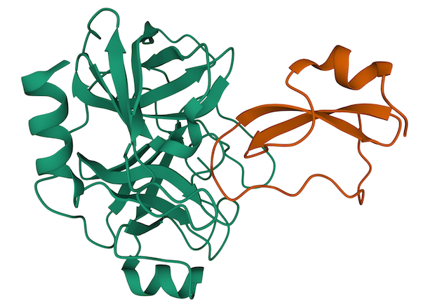
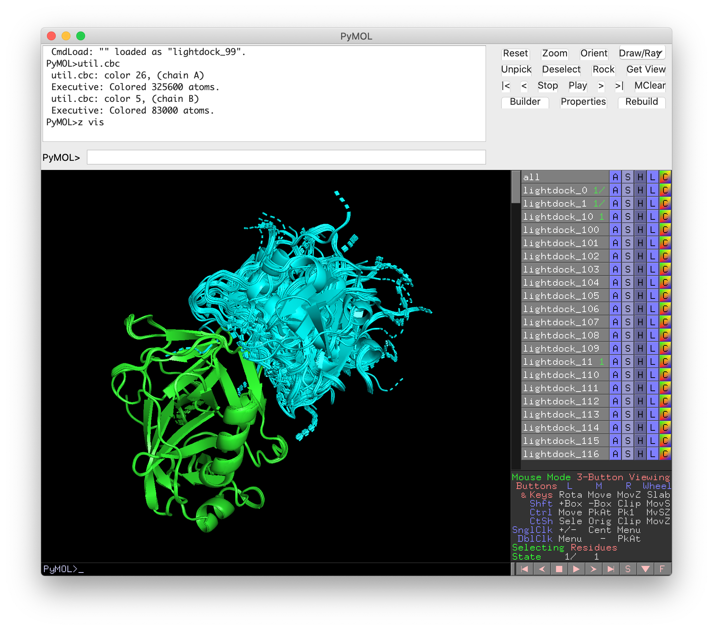

<center><h1 style="margin-top:40px">Simple protein-protein docking example</h1></center><br>

<center>
    
</center>

* table of contents
{:toc}

The simplest way to perform a protein-protein docking in LightDock is to use default parameters and to only provide two [PDB](http://www.rcsb.org/pdb/static.do?p=file_formats/pdb/index.html) files for both receptor and ligand. In this basic example, we will model the [2UUY](https://www.rcsb.org/structure/2UUY) complex starting from its unbound constituents.


## Copying the data
Create a directory and copy the sample data provided.

```bash
mkdir test
cd test
curl -O https://raw.githubusercontent.com/lightdock/lightdock.github.io/master/tutorials/examples/2UUY/2UUY_rec.pdb
curl -O https://raw.githubusercontent.com/lightdock/lightdock.github.io/master/tutorials/examples/2UUY/2UUY_lig.pdb
```

## LightDock setup

Please execute the `lightdock3_setup.py` command to prepare your LightDock simulation, an output similar to this will be displayed:

```bash
usage: lightdock3_setup [-h] [-s SWARMS] [-g GLOWWORMS] [--seed_points STARTING_POINTS_SEED]
                        [--noxt] [--noh] [--now] [--verbose_parser] [-anm] 
                        [--seed_anm ANM_SEED] [-ar ANM_REC] [-al ANM_LIG] [-r restraints] 
                        [-membrane] [-transmembrane] [-sp] [-sd SURFACE_DENSITY]
                        [-sr SWARM_RADIUS]
                        receptor_pdb_file ligand_pdb_file
lightdock3_setup: error: the following arguments are required: receptor_pdb_file, ligand_pdb_file
```

As you may notice from the displayed help, there are **2** arguments needed (the ones not enclosed by `[` and `]`) to setup a quick LightDock simulation. These are:
 
- (1) *receptor_pdb_file*, the PDB file of your receptor molecule (usually the largest) 
- (2) *ligand_pdb_file*, the PDB file of your ligand molecule (usually the smallest)

We will enable the flags to remove OXT (`--noxt`) atoms, hydrogens (`--noh`) and waters (`--now`), and the ANM support:

```bash
lightdock3_setup.py 2UUY_rec.pdb 2UUY_lig.pdb --noxt --noh --now -anm
```


A few seconds after we will see an output similar to this:

```
[lightdock3_setup] INFO: Ignoring OXT atoms
[lightdock3_setup] INFO: Ignoring Hydrogen atoms
[lightdock3_setup] INFO: Ignoring water
[lightdock3_setup] INFO: Reading structure from 2UUY_rec.pdb PDB file...
[lightdock3_setup] INFO: 1628 atoms, 223 residues read.
[lightdock3_setup] INFO: Ignoring OXT atoms
[lightdock3_setup] INFO: Ignoring Hydrogen atoms
[lightdock3_setup] INFO: Ignoring water
[lightdock3_setup] INFO: Reading structure from 2UUY_lig.pdb PDB file...
[lightdock3_setup] INFO: 415 atoms, 55 residues read.
[lightdock3_setup] INFO: Calculating reference points for receptor 2UUY_rec.pdb...
[lightdock3_setup] INFO: Reference points for receptor found, skipping
[lightdock3_setup] INFO: Done.
[lightdock3_setup] INFO: Calculating reference points for ligand 2UUY_lig.pdb...
[lightdock3_setup] INFO: Reference points for ligand found, skipping
[lightdock3_setup] INFO: Done.
[lightdock3_setup] INFO: Saving processed structure to PDB file...
[lightdock3_setup] INFO: Done.
[lightdock3_setup] INFO: Saving processed structure to PDB file...
[lightdock3_setup] INFO: Done.
[lightdock3_setup] INFO: Calculating ANM for receptor molecule...
[lightdock3_setup] INFO: 10 normal modes calculated
[lightdock3_setup] INFO: Calculating ANM for ligand molecule...
[lightdock3_setup] INFO: 10 normal modes calculated
[lightdock3_setup] INFO: Calculating starting positions...
[lightdock3_setup] INFO: Generated 182 positions files
[lightdock3_setup] INFO: Done.
[lightdock3_setup] INFO: Number of calculated swarms is 182
[lightdock3_setup] INFO: Preparing environment
[lightdock3_setup] INFO: Done.
[lightdock3_setup] INFO: LightDock setup OK
```

**NOTE** For a detailed description of the setup stage, please check the [LightDock basics](https://lightdock.org/tutorials/0.9.1/basics#2-setup-a-simulation) 

If the setup is successful, we will find a file called `setup.json`, which includes all the details about this LightDock simulation.

```json
{
    "anm_lig": 10,
    "anm_rec": 10,
    "anm_seed": 324324,
    "glowworms": 200,
    "ligand_pdb": "2UUY_lig.pdb",
    "membrane": false,
    "noh": true,
    "now": true,
    "noxt": true,
    "receptor_pdb": "2UUY_rec.pdb",
    "restraints": null,
    "starting_points_seed": 324324,
    "surface_density": 50.0,
    "swarm_radius": 10.0,
    "swarms": 182,
    "transmembrane": false,
    "use_anm": true,
    "verbose_parser": false,
    "write_starting_positions": false
}
```

This file is meant to be used for the simulation and reproducibility purposes. It can be also used to double check your parameters prior running the simulation starts.

**IMPORTANT** You should not modify it unless you know what you are doing ;-)

Besides of `setup.json`, we find that several `lightdock*` files have been generated as well as an `init/` and several `swarm_*` directories.

The `init/` directory contains both the exact positions of the swarms (`swarm_centers.pdb`) and the starting positions of the glowworms (in this case 200 ligand conformations `starting_positions_0.pdb`). In the latter, the suffix *0* indicates the ID of the swarm.

Once the simulation is finished, the results will appear inside each of the `swarm_*` directories.

**TIP** If for any reason the setup stage fails, please remove all generated files before trying again. E.g: `rm -rf lightdock* setup.json init/ swarm_*`


## LightDock simulation
Once the setup is successful, execute the `lightdock3.py` command in order to run your first LightDock simulation. If you execute `lightdock3.py` without arguments a help menu will appear.

```bash

usage: lightdock3 [-h] [-f configuration_file] [-s SCORING_FUNCTION] [-sg GSO_SEED] 
                  [-t TRANSLATION_STEP] [-r ROTATION_STEP] [-V] [-c CORES] [--profile] 
                  [-mpi] [-ns NMODES_STEP]
                  [-min] [--listscoring] [-l SWARM_LIST [SWARM_LIST ...]]
                  setup_file steps
lightdock3: error: the following arguments are required: setup_file, steps
```

There are **2** mandatory arguments (the ones not enclosed by `[` and `]`) to run a quick LightDock simulation. These are:

- (1) *setup.json*, the file containing all parameters needed for the simulation
- (2) *steps*, an integer referring to the number of steps (`steps`)

In this case, we will only perform **100 steps on the swarm 0** with the following command:

```bash
lightdock3.py setup.json 100 -c 1 -l 0
```

You will see an output similar to this after a couple of minutes:

```
@> ProDy is configured: verbosity='info'
[lightdock3_setup] INFO: Ignoring OXT atoms
[lightdock3_setup] INFO: Ignoring Hydrogen atoms
[lightdock3_setup] INFO: Ignoring water
[lightdock3_setup] INFO: Reading structure from lightdock_2UUY_rec.pdb PDB file...
[lightdock3_setup] INFO: 1628 atoms, 223 residues read.
[lightdock3_setup] INFO: Ignoring OXT atoms
[lightdock3_setup] INFO: Ignoring Hydrogen atoms
[lightdock3_setup] INFO: Ignoring water
[lightdock3_setup] INFO: Reading structure from lightdock_2UUY_lig.pdb PDB file...
[lightdock3_setup] INFO: 415 atoms, 55 residues read.
[lightdock] INFO: Loading scoring function...
[lightdock] INFO: Using DFIRE scoring function
[lightdock] INFO: Done.
[kraken] INFO: Kraken has 1 tentacles (cpu cores)
[kraken] INFO: Tentacle ready with 1 tasks
[kraken] INFO: 1 ships ready to be smashed
[lightdock] INFO: Monster spotted
[kraken] INFO: Release the Kraken!
[0] step 1
[0] step 2
[0] step 3
[0] step 4
[0] step 5
[0] step 6
[0] step 7
[0] step 8
[0] step 9
[0] step 10
...
[0] step 100
[kraken] INFO: folding tentacle Tentacle-1
[kraken] INFO: 1 ships destroyed
[lightdock] INFO: Finished.
```

By default, and if no other scoring function is specified, LightDock makes use of the C-implementation of the DFIRE scoring function (`fastdfire`). For a complete list of the current supported scoring functions, please run `lightdock3.py --listscoring`.

As you may have noticed, we have instructed LightDock to use only 1 CPU core (`-c 1`). By default, LightDock will look for the total number of available cores. If you want to specify a different number, use the flag `-c`. MPI is also supported by using the `-mpi` flag.

**NOTE** For more information about the simulation stage, please check the [LightDock basics](https://lightdock.org/tutorials/0.9.1./basics#3-run-a-simulation)


## LightDock results

If the run is successful and the *Kraken* is back to sleep, we will find the output files for each of the independent swarms. In this case since we only simulated **1 swarm**, the results will be inside `swarm_0`. The output files will be named as `gso_X.out`, being `X` is the step number.

**NOTE** LightDock will only store the results **every 10** simulation steps (0, 10, 20, 30, etc.)

In each of the output files, every line corresponds to a glowworm agent in the GSO algorithm. The numbers enclosed by `(` and `)`, refer to the `[x,y,z]` coordinates in the translational space and the quaternion vector (`q = a + 0i + 0j + 0k`) in the rotational space. If ANM is enabled, this vector would expand by the number of normal modes considered for receptor and ligand respectively. 

The coordinates of the predicted complexes are followed by the ID of the complex and the last column refers to the scoring, in this case as calculated with DFIRE:

```bash
head -2 swarm_0/gso_100.out
```

```json
#Coordinates  RecID  LigID  Luciferin  Neighbor's number  Vision Range  Scoring
( 8.3619938, -9.0568297, -23.0839562, -0.6368250, -0.1214085,  0.4488531, -0.6150161,  5.2922640,  4.6293871,  5.1679589,  3.6238049,  3.9717360,  7.2390017,  4.5821031,  5.4562578,  1.9734713,  2.9626742,  1.0323748,  5.8207747,  3.4377706,  2.6552282,  4.8705878,  3.0931470,  3.4670304,  3.9487060,  2.4948334,  4.5626560)    0    0  27.83190014  6 0.320  18.65982945
```

## Generate predicted models

Finally, to generate the resulting docked structures in PDB format, we will use the script `lgd_generate_conformations.py`. We will need to run this script for each of the generated swarms and provide four different arguments:

- (1) receptor PDB structure file name
- (2) ligand PDB structure file name
- (3) *lightdock_output*, the output file (usually the last step of the simulation)
- (4) *glowworms*, an integer indicating the number of complexes to generate (<= number of glowworms used in the simulation)

Please note that, it is only possible to generate the docked conformations according to a single output file. 

**TIP** If you want to generate the full trajectory for a given `swarm`, you should independently generate the conformations for every output file.

```bash
cd swarm_0
lgd_generate_conformations.py ../2UUY_rec.pdb ../2UUY_lig.pdb gso_100.out 200
```

```
[generate_conformations] INFO: Reading ../lightdock_2UUY_rec.pdb receptor PDB file...
[generate_conformations] INFO: 1628 atoms, 223 residues read.
[generate_conformations] INFO: Reading ../lightdock_2UUY_lig.pdb ligand PDB file...
[generate_conformations] INFO: 415 atoms, 55 residues read.
[generate_conformations] INFO: Read 200 coordinate lines
[generate_conformations] INFO: Generated 200 conformations
```

Inside the `swarm_0` folder, we will find 200 new PDB structures corresponding to the 200 glowworm agents used in the current example. Try opening them on PyMOL and have a quick look at them:

<center>
    
</center>

**Congratulations!** You have successfully run your first docking simulation with LightDock!
{: .notice--success}

You can find all the simulation data already generated here: [simulation.tgz](/tutorials/0.9.1/simple_docking/data/simulation.tgz)

<br>

# References
For a more complete description of the algorithm as well as different tutorials, please refer to [LightDock](https://lightdock.org/), or check the following references:

- **Integrative Modeling of Membrane-associated Protein Assemblies**<br>
Jorge Roel-Touris, [Brian Jiménez-García](https://bjimenezgarcia.com) & Alexandre M.J.J. Bonvin<br>
*Nat Commun* **11**, 6210 (2020); doi: [https://doi.org/10.1038/s41467-020-20076-5](https://doi.org/10.1038/s41467-020-20076-5)

- **LightDock goes information-driven**<br>
Jorge Roel-Touris, Alexandre M.J.J. Bonvin and [Brian Jiménez-García](https://bjimenezgarcia.com)<br>
*Bioinformatics*, Volume 36, Issue 3, 1 February 2020, Pages 950–952, doi: [https://doi.org/10.1093/bioinformatics/btz642](https://doi.org/10.1093/bioinformatics/btz642)

- **LightDock: a new multi-scale approach to protein–protein docking**<br>
[Brian Jiménez-García](https://bjimenezgarcia.com), Jorge Roel-Touris, Miguel Romero-Durana, Miquel Vidal, Daniel Jiménez-González and Juan Fernández-Recio<br>
*Bioinformatics*, Volume 34, Issue 1, 1 January 2018, Pages 49–55, doi: [https://doi.org/10.1093/bioinformatics/btx555](https://doi.org/10.1093/bioinformatics/btx555)
