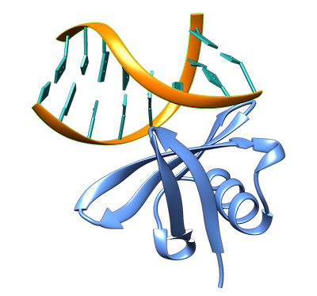

<center><h1>Protein-DNA docking example</h1></center><br>

This is a complete example of the LightDock docking protocol to model [1AZP](https://www.rcsb.org/structure/1azp) protein-DNA complex with the use of **residue restraints**.<br>

<p align="center">
    
</p>

**IMPORTANT** Please, make sure that you have the <code>python3</code> version of LightDock installed (<code>pip3 install lightdock</code>). We advise you to follow the basic tutorial about how to run a quick [LightDock simulation](https://lightdock.org/tutorials/2UUY)

## Copying the data
Create a directory and copy the sample data provided.

```bash
cd Desktop
mkdir test
cd test
curl -O https://raw.githubusercontent.com/lightdock/lightdock.github.io/master/tutorials/examples/1AZP/1AZP_A.pdb
curl -O https://raw.githubusercontent.com/lightdock/lightdock.github.io/master/tutorials/examples/1AZP/1AZP_B.pdb
```

## Specifying residue restraints
LightDock is able to use information derived from either experimental information and/or bioinformatic predictions to drive the docking at several levels. This information is used in the form of **residue restraints**.

To do so, we first need to create a `restraints.list` file of the following form.

```bash
R A.GLN.27
R A.SER.30
R A.TYR.32
...
L B.DA.68
L B.DC.69
L B.DA.70
...
```

Where the first column will indicate whether it is a receptor `R` or ligand `L` restraint, followed by `CHAIN_ID.RESIDUE_NAME.RESIDUE_NUMBER`. In this case, LightDock will consider these residue restraints as ACTIVE.

By contrast, if you want to define your residue restraints as PASSIVE you should add an additional column with a `P` label.

```bash
R A.GLN.27 P
R A.SER.30 P
R A.TYR.32 P
...
L B.DA.68 P
L B.DC.69 P
L B.DA.70 P
...
```
**NOTE** For a detailed description of the exact implications of ACTIVE and PASSIVE restraints in LightDock, please refer to [LightDock goes information-driven](https://doi.org/10.1093/bioinformatics/btz642)

For the sake of simplicity, we will use a list of residue restraints already formatted.

```bash
curl -O https://raw.githubusercontent.com/lightdock/lightdock.github.io/master/tutorials/examples/1AZP/restraints.list
cat restraints.list

R A.TRP.24
R A.VAL.26
R A.ARG.42
```

To make the calculations faster, we will only define **three residues** on the protein side.

## Removing and adding hydrogen atoms

First of all, we need the protein partner to have the correct hydrogen atoms as parametrixed in our `dna` scoring function (`dna` scoring function is based in AMBER force-field). To do it so, we will use the software `reduce` which can be downloaded from [GitHub](https://github.com/rlabduke/reduce).

We remove the previous hydrogens and them rebuild them according to reduce.

```bash
reduce -Trim 1AZP_A.pdb > 1AZP_A_noh.pdb
reduce -BUILD 1AZP_A_noh.pdb > 1AZP_A_h.pdb
```

## Setup

First, we need to run the setup step. We will specify a number of 400 initial swarms and 200 glowworms and will enable flexibility.

At this step, we need to also specify the residue restraints that will bias the docking simulation.

```bash
lightdock_setup3.py 1AZP_A_h.pdb 1AZP_B.pdb 400 200 -anm -rst restraints.list

@> ProDy is configured: verbosity='info'
[lightdock_setup] INFO: Reading structure from 1AZP_A_h.pdb PDB file...
[lightdock_setup] INFO: 1094 atoms, 66 residues read.
[lightdock_setup] INFO: Reading structure from 1AZP_B.pdb PDB file...
[pdb] WARNING: Possible problem: [ResidueNonStandardError] Can not check non-standard residue DG.1
[pdb] WARNING: Possible problem: [ResidueNonStandardError] Can not check non-standard residue DC.2
[pdb] WARNING: Possible problem: [ResidueNonStandardError] Can not check non-standard residue DG.3
[pdb] WARNING: Possible problem: [ResidueNonStandardError] Can not check non-standard residue DA.4
[pdb] WARNING: Possible problem: [ResidueNonStandardError] Can not check non-standard residue DT.5
[pdb] WARNING: Possible problem: [ResidueNonStandardError] Can not check non-standard residue DC.6
[pdb] WARNING: Possible problem: [ResidueNonStandardError] Can not check non-standard residue DG.7
[pdb] WARNING: Possible problem: [ResidueNonStandardError] Can not check non-standard residue DC.8
[pdb] WARNING: Possible problem: [ResidueNonStandardError] Can not check non-standard residue DG.9
[pdb] WARNING: Possible problem: [ResidueNonStandardError] Can not check non-standard residue DC.10
[pdb] WARNING: Possible problem: [ResidueNonStandardError] Can not check non-standard residue DG.11
[pdb] WARNING: Possible problem: [ResidueNonStandardError] Can not check non-standard residue DA.12
[pdb] WARNING: Possible problem: [ResidueNonStandardError] Can not check non-standard residue DT.13
[pdb] WARNING: Possible problem: [ResidueNonStandardError] Can not check non-standard residue DC.14
[pdb] WARNING: Possible problem: [ResidueNonStandardError] Can not check non-standard residue DG.15
[pdb] WARNING: Possible problem: [ResidueNonStandardError] Can not check non-standard residue DC.16
[lightdock_setup] INFO: 328 atoms, 16 residues read.
[lightdock_setup] INFO: Calculating reference points for receptor 1AZP_A_h.pdb...
[lightdock_setup] INFO: Done.
[lightdock_setup] INFO: Calculating reference points for ligand 1AZP_B.pdb...
[lightdock_setup] INFO: Done.
[lightdock_setup] INFO: Saving processed structure to PDB file...
[lightdock_setup] INFO: Done.
[lightdock_setup] INFO: Saving processed structure to PDB file...
[lightdock_setup] INFO: Done.
[lightdock_setup] INFO: Calculating ANM for receptor molecule...
[lightdock_setup] INFO: 10 normal modes calculated
[lightdock_setup] INFO: Calculating ANM for ligand molecule...
[lightdock_setup] INFO: 10 normal modes calculated
[lightdock_setup] INFO: Reading restraints from restraints.list
[lightdock_setup] INFO: Number of receptor restraints is: 3 (active), 0 (passive)
[lightdock_setup] INFO: Number of ligand restraints is: 0 (active), 0 (passive)
[lightdock_setup] INFO: Calculating starting positions...
[lightdock_setup] INFO: Generated 27 positions files
[lightdock_setup] INFO: Done.
[lightdock_setup] INFO: Number of swarms is 27 after applying restraints
[lightdock_setup] INFO: Preparing environment
[lightdock_setup] INFO: Done.
[lightdock_setup] INFO: LightDock setup OK
```

At the moment, LightDock is not checking the structure of the nucleotides but rather the naming. This is the reason of the several warning appearing. It is safe to ignore them.

## Simulation

We can run our simulation in a local machine or in a HPC cluster. For the first option, simply run the following command.

```bash
lightdock3.py setup.json 100 -s dna -c 8
```

Where the flag `-c 8` indicates LightDock to use 8 available cores. For this example we will run `100` steps of the protocol and the DNA scoring function `-s dna`.


To run a LightDock job on a HPC cluster, a Portable Batch System (PBS) file can be generated. This PBS file defines the commands and cluster resources used for the job. A PBS file is a plain-text file that can be easily edited with any UNIX editor. 

For example, create a `submit_job.sh` file containing:

```bash
#PBS -N LightDock-1AZP
#PBS -q medium
#PBS -l nodes=1:ppn=16
#PBS -S /bin/bash
#PBS -d ./
#PBS -e ./lightdock.err
#PBS -o ./lightdock.out

lightdock3.py setup.json 100 -s dna -c 16
```

This script tells the PBS queue manager to use 16 cores of a single node in a queue with name `medium`, with job name `LigthDock-1AZP` and with standard output to `lightdock.out` and error output redirected to `lightdock.err`.

To run this script you can do it as:

```
qsub < submit_job.sh
```

## Analysis

Once the simulation has finished (it takes around 1-2 min per 10 steps per swarm), we need to analyze the results as:

- (1) Generate the structures per swarm (200 glowworms per swarm in this example)
- (2) Clusterize the predictions per swarm
- (3) Generate the ranking files
- (4) Filter by a percentage of satisfied restraints (this is a highly recommended step: >40% in this example)

Here there is a PBS script to do so.

```bash
#PBS -N 1AZP-anal
#PBS -q medium
#PBS -l nodes=1:ppn=8
#PBS -S /bin/bash
#PBS -d ./
#PBS -e ./analysis.err
#PBS -o ./analysis.out

### Calculate the number of swarms ###

s=`ls -d ./swarm_* | wc -l`
swarms=$((s-1))


### Create files for Ant-Thony ###

for i in $(seq 0 $swarms)
  do
    echo "cd swarm_${i}; lgd_generate_conformations.py ../1AZP_A_h.pdb ../1AZP_B_h.pdb  gso_100.out 200 > /dev/null 2> /dev/null;" >> generate_lightdock.list;
  done

for i in $(seq 0 $swarms)
  do
    echo "cd swarm_${i}; lgd_cluster_bsas.py gso_100.out > /dev/null 2> /dev/null;" >> cluster_lightdock.list;
  done


### Generate LightDock models ###

ant_thony.py -c 8 generate_lightdock.list;


### Clustering BSAS (rmsd) within swarm ###

ant_thony.py -c 8 cluster_lightdock.list;


### Generate ranking files for filtering ###

lgd_rank.py $s 100;


### Filtering models by >40% of satisfied restraints ###

lgd_filter_restraints.py --cutoff 5.0 --fnat 0.4 rank_by_scoring.list restraints.list A B > /dev/null 2> /dev/null;

```

**NOTE** You can also run the previous commands locally in a sequential way.

Once the analysis is finished, a new folder called `filtered` has been created, which contains any predicted structure which satisfies our 40% filtering. Inside of this directory, there is a file with the ranking of these structures by LightDock `dna` score (the more positive the better) `rank_filtered.list`.

We provide for this example a compressed folder [1AZP.tgz](examples/1AZP.tgz) of the complete run.
<br>

# References
For a more complete description of the algorithm as well as different tutorials, please refer to [LightDock](https://lightdock.org/), or check the following references:

- **LightDock: a new multi-scale approach to protein–protein docking**<br>
[Brian Jiménez-García](http://bjimenezgarcia.com), Jorge Roel-Touris, Miguel Romero-Durana, Miquel Vidal, Daniel Jiménez-González and Juan Fernández-Recio<br>
*Bioinformatics*, Volume 34, Issue 1, 1 January 2018, Pages 49–55, [https://doi.org/10.1093/bioinformatics/btx555](https://doi.org/10.1093/bioinformatics/btx555)

- **LightDock goes information-driven**<br>
Jorge Roel-Touris, Alexandre M.J.J. Bonvin and [Brian Jiménez-García](http://bjimenezgarcia.com)<br>
*Bioinformatics*, btz642; doi: [https://doi.org/10.1093/bioinformatics/btz642](https://doi.org/10.1093/bioinformatics/btz642)
