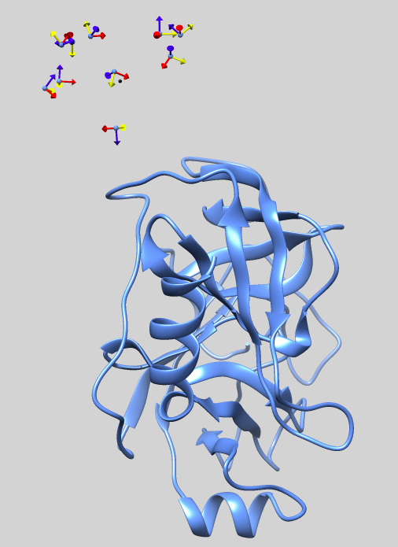

<center> <h1>LightDock basic docking example</h1> </center>

The simplest way to perform a protein-protein docking in LightDock is to use default parameters and to only provide two [PDB](http://www.rcsb.org/pdb/static.do?p=file_formats/pdb/index.html) files for both receptor and ligand. In this basic example, we will reconstitute the [2UUY](https://www.rcsb.org/structure/2UUY) complex, starting from its unbound constituents.

**IMPORTANT** Please, make sure that you have the <code>python3</code> version of LightDock installed (You can easily install it by running: <code>pip3 install lightdock</code>). In order to perform your first protein-protein docking with LightDock, please follow the next steps!

## Copying data
Create a directory and copy the sample data provided:

```bash
$ cd ~/Desktop
$ mkdir test
$ cd test
$ wget https://raw.githubusercontent.com/lightdock/lightdock.github.io/master/tutorials/examples/2UUY/2UUY_rec.pdb
$ wget https://raw.githubusercontent.com/lightdock/lightdock.github.io/master/tutorials/examples/2UUY/2UUY_lig.pdb
```

## LightDock setup
In previous versions of LightDock, a setup step was not required. This has changed from **version 0.5.0** and now a simulation setup is required. To do so, please execute <code>lightdock3_setup.py</code> script in order to prepare your LightDock simulation:

```bash
$ lightdock3_setup.py

usage: lightdock_setup [-h] [--seed_points STARTING_POINTS_SEED]
                       [-ft ftdock_file] [--noxt] [-anm] [--seed_anm ANM_SEED]
                       [-anm_rec ANM_REC] [-anm_lig ANM_LIG] [-rst restraints]
                       [-membrane]
                       receptor_pdb_file ligand_pdb_file swarms glowworms
lightdock_setup: error: too few arguments
```

As you may notice from the displayed help, there are **4** arguments needed (the ones not enclosed by [ ]) to setup a quick LightDock simulation. These are: (1) The receptor and (2) ligand PDB files (`receptor_pdb_file` and `ligand_pdb_file`), (3) an integer corresponding to number of swarms to be generated (`swarms`) and (4) an integer referring to the number of starting ligand conformations (`glowworms`). For a detailed description of the setup stage, please check the [LightDock basics](https://lightdock.org/tutorials/basics#2-setup-a-simulation) 

For the sake of simplicity, we will generate **1 swarm** containing **10 glowworms** with the following command:

```bash
$ lightdock3_setup.py 2UUY_rec.pdb 2UUY_lig.pdb 1 10

[lightdock_setup] INFO: Reading structure from 2UUY_rec.pdb PDB file...
[lightdock_setup] INFO: 1628 atoms, 223 residues read.
[lightdock_setup] INFO: Reading structure from 2UUY_lig.pdb PDB file...
[lightdock_setup] INFO: 415 atoms, 55 residues read.
[lightdock_setup] INFO: Calculating reference points for receptor 2UUY_rec.pdb...
[lightdock_setup] INFO: Done.
[lightdock_setup] INFO: Calculating reference points for ligand 2UUY_lig.pdb...
[lightdock_setup] INFO: Done.
[lightdock_setup] INFO: Saving processed structure to PDB file...
[lightdock_setup] INFO: Done.
[lightdock_setup] INFO: Saving processed structure to PDB file...
[lightdock_setup] INFO: Done.
[lightdock_setup] INFO: Calculating starting positions...
[lightdock_setup] INFO: Generated 1 positions files
[lightdock_setup] INFO: Done.
[lightdock_setup] INFO: Preparing environment
[lightdock_setup] INFO: Done.
[lightdock_setup] INFO: LightDock setup OK
```

If the setup is successful, we find a file called <code>setup.json</code>, which includes all the details about LightDock simulation:

```bash
$ cat setup.json

{
    "anm_lig": 10,
    "anm_rec": 10,
    "anm_seed": 324324,
    "ftdock_file": null,
    "glowworms": 10,
    "ligand_pdb": "2UUY_lig.pdb",
    "membrane": false,
    "noh": false,
    "noxt": false,
    "receptor_pdb": "2UUY_rec.pdb",
    "restraints": null,
    "starting_points_seed": 324324,
    "swarms": 1,
    "use_anm": false,
    "verbose_parser": false
}
```

This file is meant to be used for the simulation and reproducibility purposes. It can be also used to double check your simulation's parameters prior running LightDock. You should not modify it unless you know what you are doing ;-)

Besides of <code>setup.json</code>, we find that several <code>lightdock</code> files have been generated as well as an <code>init/</code> and several <code>swarm</code> directories. The <code>init/</code> directory contains both the exact positions of the swarms (in this case a unique swarm <code>cluster_centers.pdb</code>) and the starting positions of the glowworms (in this case 10 ligand conformations <code>starting_positions_0.pdb</code>). In the latter, <code>0</code> indicates the ID of the swarm. On the other hand, once the simulation is finished, the results will appear inside each of the <code>swarm</code> directories. Please refer to the following picture for a graphical description of the setup.

<p align="center">
    
</p>

**TIP** If for any reason the setup stage fails, please remove all generated files before trying again. <code>rm -rf lightdock* setup.json init/ swarm_*</code>

## LightDock simulation
Once the setup is successful, execute <code>lightdock3.py</code> script in order to run your first LightDock simulation. If you execute <code>lightdock3.py</code> without arguments a help menu will appear:

```bash
$ lightdock3.py

usage: lightdock [-h] [-f configuration_file] [-s SCORING_FUNCTION]
                 [-sg GSO_SEED] [-t TRANSLATION_STEP] [-r ROTATION_STEP] [-V]
                 [-c CORES] [--profile] [-mpi] [-ns NMODES_STEP] [-min]
                 [--listscoring]
                 setup_file steps
lightdock: error: too few arguments
```

There are **2** mandatory arguments (the ones not enclosed by [ ]) to run a quick LightDock simulation. These are: (1) The file containing all parameters for the simulation (`setup.json`) and (2) an integer referring to the number of steps (`steps`). For more information about the simulation stage, please check the [LightDock basics](https://lightdock.org/tutorials/basics#3-run-a-simulation)

In this case, we will only perform **10 steps** of GSO optimization with the following command:

```bash
$ lightdock3.py setup.json 10


@> ProDy is configured: verbosity='info'
[lightdock] INFO: simulation parameters saved to ./lightdock.info
[lightdock_setup] INFO: Reading structure from 2UUY_rec.pdb PDB file...
[lightdock_setup] INFO: 1628 atoms, 223 residues read.
[lightdock_setup] INFO: Reading structure from 2UUY_lig.pdb PDB file...
[lightdock_setup] INFO: 415 atoms, 55 residues read.
[lightdock] INFO: Loading scoring function...
[lightdock] INFO: Using DFIRE scoring function
[lightdock] INFO: Done.
[kraken] WARNING: Number of cores has not been specified or is incorrect. Using available cores.
[kraken] INFO: Kraken has 4 tentacles (cpu cores)
[kraken] INFO: Tentacle ready with 1 tasks
[kraken] INFO: Tentacle ready with 0 tasks
[kraken] INFO: Tentacle ready with 0 tasks
[kraken] INFO: Tentacle ready with 0 tasks
[kraken] INFO: 1 ships ready to be smashed
[lightdock] INFO: Monster spotted
[kraken] INFO: Release the Kraken!
[kraken] INFO: folding tentacle Tentacle-2
[0] step 1
[kraken] INFO: folding tentacle Tentacle-4
[kraken] INFO: folding tentacle Tentacle-3
[0] step 2
[0] step 3
[0] step 4
[0] step 5
[0] step 6
[0] step 7
[0] step 8
[0] step 9
[0] step 10
[kraken] INFO: folding tentacle Tentacle-1
[kraken] INFO: 1 ships destroyed
[lightdock] INFO: Finished.
```

By default and if no other scoring function is specified, LightDock makes use of the DFIRE scoring function. However, we recommend to make use of its fast implementation <code>fastdfire</code>. For a complete list of the current supported scoring functions, please run <code>lightdock --listscoring</code>.

As you may have noticed, there is a warning on the number of CPU cores used <code>[kraken] WARNING: Number of cores has not been specified or is incorrect. Using available cores.</code> By default, LightDock will look for the total number of available cores. If you want to specify a different number, use the flag <code>-c NUMBER_CORES</code>. **NOTE** MPI is also supported using the -mpi flag.

## LightDock results

If the run has been successful and the kraken is back to sleep, we will find the output files for each of the independent swarms. In this case since we only generated **1 swarm**, the results will be inside <code>swarm_0</code>. The output files will be named as <code>gso_X.out</code>, being X the step number. **NOTE** By default, LightDock will only store the results **every 10** simulation steps (0, 10, 20, 30, ...) In our case, under <code>swarm_0</code> we will only find **2 output files** (`gso_0.out` and `gso_10.out`).

In each of the output files, every line corresponds to a glowworm agent in the algorithm. The numbers enclosed by ( ), refer to the x,y,z coordinates in the translational space + the quaternion vector (q = a + 0i + 0j + 0k) in the rotational space. If ANM were enabled, this vector would expand by the number normal modes considered for receptor and ligand respectively. The coordinates are followed by the ID of the complex and the last column refers to the scoring, in this case as calculated with DFIRE.

```bash
$ head -2 swarm_0/gso_10.out

#Coordinates  RecID  LigID  Luciferin  Neighbor's number  Vision Range  Scoring
(31.4171143,  1.8570079, -6.3956223, -0.1058407, -0.4849369,  0.5997430, -0.6276482)    0    0  11.25395618  0 4.200   7.52800101
```

## Generation of PDB complexes

Finally, to generate the final docked PDB structures, we will use the script <code>lgd_generate_conformations.py</code>. We will need to run this script for each of the generated swarms and a given number of glowworms. Please note that, it is only possible to generated the docked conformations according to a single output file. **TIP** If you want to generate the full trajectory for a given <code>swarm</code>, you should independently generate the conformations for every output file.

```bash
$ cd swarm_0
$ lgd_generate_conformations.py ../2UUY_rec.pdb ../2UUY_lig.pdb gso_10.out 10

@> ProDy is configured: verbosity='info'
[generate_conformations] INFO: Reading ../lightdock_2UUY_rec.pdb receptor PDB file...
[generate_conformations] INFO: 1628 atoms, 223 residues read.
[generate_conformations] INFO: Reading ../lightdock_2UUY_lig.pdb ligand PDB file...
[generate_conformations] INFO: 415 atoms, 55 residues read.
[generate_conformations] INFO: Read 10 coordinate lines
[generate_conformations] INFO: Generated 10 conformations
```

Inside the <code>swarm_0</code> folder, we will find 10 new PDB structures corresponding to the 10 glowworm agents used in the current example.

```bash
CONGRATS! You have successfully run your first docking simulation with LightDock!
```


# References
For a more complete description of the algorithm as well as different tutorials, please refer to [LightDock](https://lightdock.org/), or check the following references:

**LightDock: a new multi-scale approach to protein–protein docking**<br>
[Brian Jiménez-García](http://bjimenezgarcia.com), Jorge Roel-Touris, Miguel Romero-Durana, Miquel Vidal, Daniel Jiménez-González and Juan Fernández-Recio<br>
*Bioinformatics*, Volume 34, Issue 1, 1 January 2018, Pages 49–55, [https://doi.org/10.1093/bioinformatics/btx555](https://doi.org/10.1093/bioinformatics/btx555)

 **LightDock goes information-driven**<br>
 Jorge Roel-Touris, Alexandre M.J.J. Bonvin and [Brian Jiménez-García](http://bjimenezgarcia.com)<br>
 *Bioinformatics*, btz642; doi: [https://doi.org/10.1093/bioinformatics/btz642](https://doi.org/10.1093/bioinformatics/btz642)
