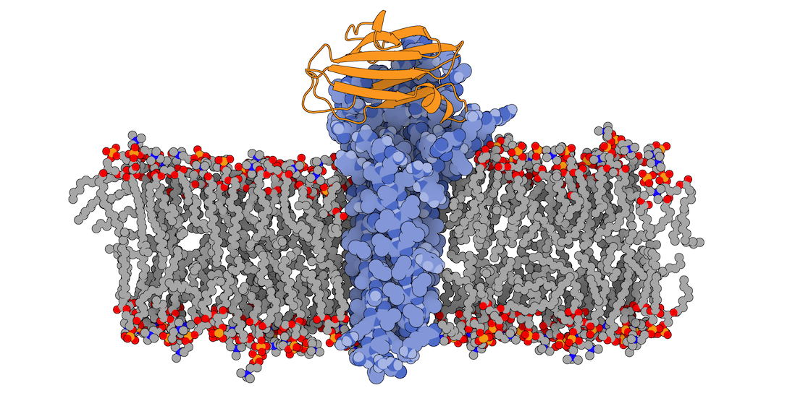
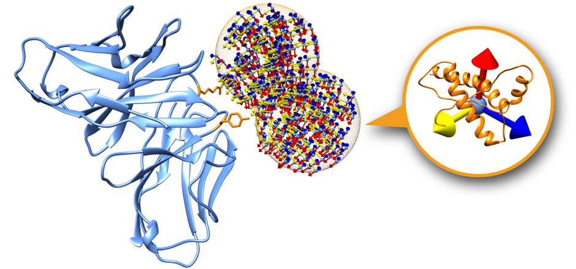

<h1 style="margin-top:40px">Membrane-associated protein docking</h1>
 

* table of contents
{:toc}

## 1. Introduction
This tutorial demonstrates the use of [LightDock](https://lightdock.org) for predicting the structure of membrane receptor–soluble protein complex using the topological information provided by the membrane to guide the modeling process. We will be following the protocol described in [Roel-Touris *et al*, 2020](https://www.nature.com/articles/s41467-020-20076-5).

Membrane proteins are among the most challenging systems to study with experimental structural biology techniques, thus computational techniques such as docking might offer invaluable insights on the modeling of those systems.

<figure style="text-align:center">
    
    <figcaption style="text-align:center"><b>Fig.1</b> 3X29 complex in a lipid bilayer as simulated by <a href="http://memprotmd.bioch.ox.ac.uk/_ref/PDB/3x29" target="_blank">MemProtMD</a>.</figcaption>
</figure>

In this tutorial we will be working with the crystal structure  of *Mus musculus* [Claudin-19](http://www.ebi.ac.uk/interpro/entry/InterPro/IPR006187/) transmembrane protein (PDB code [3X29](https://www.ebi.ac.uk/pdbe/entry/pdb/3x29), chain A) in complex with the unbound C-terminal fragment of the *Clostridium perfringens* [Enteroxin](http://www.ebi.ac.uk/interpro/entry/InterPro/IPR003897/) (PDB code [2QUO](https://www.ebi.ac.uk/pdbe/entry/pdb/2quo), chain A). The PDB code of the complex is [3X29](https://www.ebi.ac.uk/pdbe/entry/pdb/3x29) (chains A and B).

3X29 complex is one of the cases covered in the [MemCplxDB](https://github.com/haddocking/MemCplxDB) membrane protein complex benchmark ([Koukos _et al_, 2018](https://www.sciencedirect.com/science/article/pii/S0022283618308222)). Despite not being one of the most challenging cases covered in the benchmark in terms of flexibility, its relatively small size will help us describing the complete modeling protocol in the short time intended for a tutorial.

For this tutorial we will make use of the [LightDock software](https://lightdock.org/) and the [LightDock server](https://server.lightdock.org/) (which is currently under open beta version).

The integrative approach followed in this tutorial is described here:

* J. Roel-Touris, B. Jimenez-Garcia and A.M.J.J. Bonvin. [Integrative modeling of membrane-associated protein assemblies](https://www.nature.com/articles/s41467-020-20076-5). *Nat. Commun.*, **11**, 6210 (2020).

LightDock docking framework is described in the following publications:

* J. Roel-Touris, A.M.J.J. Bonvin and B. Jimenez-Garcia. [LightDock goes information-driven](https://doi.org/10.1093/bioinformatics/btz642). *Bioinformatics*, **36**:3 950-952 (2020).

* B. Jimenez-Garcia, J. Roel-Touris, M. Romero-Durana, M. Vidal, D. Jimenez-Gonzalez, J. Fernandez-Recio. [LightDock: a new multi-scale approach to protein-protein docking](https://doi.org/10.1093/bioinformatics/btx555). *Bioinformatics*, **34**:1 49-55 (2018).

## 2. General concepts

LightDock is a macromolecular docking software written in the Python programming language, designed as a framework for rapid prototyping and test of scientific hypothesis in structural biology. It was designed to be easily extensible by users and scalable for high-throughput computing (HTC). LightDock is capable of modeling backbone flexibility of molecules using anisotropic model networks ([ANM](https://en.wikipedia.org/wiki/Anisotropic_Network_Model)) and the energetic minimization is based on the [Glowworm Swarm Optimization](https://dx.doi.org/10.1007/978-3-319-51595-3) (GSO) algorithm.

LightDock protocol is divided in two main steps: **setup** and **simulation**. On setup step, input PDB structures for receptor and ligand partners are parsed and prepared for the simulation. Moreover, a set of *swarms* is arranged around the receptor surface. Each of these swarms represents an independent simulation in LightDock where a fixed number of agents, called *glowworms*, encodes for a possible receptor-ligand pose. During the simulation step, each of these glowworms will sample a given region of the energetic landscape depending on its neighboring glowworms. 

<figure style="text-align:center">
    
    <figcaption style="text-align:center"><b>Fig.2</b> A receptor surface showing only two swarms. Each swarm contains a set of glowworms representing a possible receptor-ligand pose.</figcaption>
</figure>

Swarms on the receptor surface can be easily filtered according to regions of interest. Figure 2 shows an example where only two swarms have been calculated to focus on two residues of interest on the receptor partner (depicted in orange). **On this tutorial we will explore this capability in order to filter out incompatible transmembrane binding regions in membrane complex docking**.

For more information about LightDock, please visit the [tutorials section](https://lightdock.org/tutorials/).

