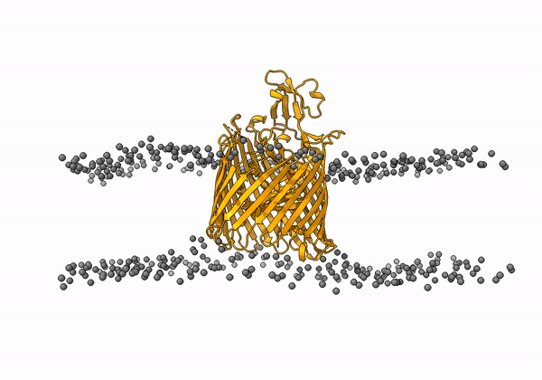

<center><h1>Membrane-associated protein docking</h1></center><br>

This is a complete example of the LightDock docking protocol to model the [2HDI](https://www.rcsb.org/structure/2hdi) membrane-associated protein system with the use of an **implicit membrane representation** provided by the [MemProtMD](http://memprotmd.bioch.ox.ac.uk/) database.

**IMPORTANT** Please, make sure that you have the <code>python3</code> version of LightDock installed (<code>pip3 install lightdock</code>). We advise you to follow the basic tutorial about how to run a quick [LightDock simulation](https://lightdock.org/tutorials/2UUY)

Here, we provide a complete *step-by-step* guide to model the interaction between the Colicin I receptor Cir (*beta*-barrel) in complex with receptor binding domain of Colicin Ia.

## 1. Copying the data
Create a directory and copy the sample data provided.

```bash
cd Desktop
mkdir test
cd test
curl -O https://raw.githubusercontent.com/haddocking/MemCplxDB/master/structures/2hdi/2hdi_unbound_A.pdb
curl -O https://raw.githubusercontent.com/haddocking/MemCplxDB/master/structures/2hdi/2hdi_unbound_B.pdb
curl -O https://raw.githubusercontent.com/lightdock/lightdock.github.io/master/tutorials/examples/2HDI/2hdi-coarsegrain.pdb
```

Where `2hdi_unbound_A.pdb` corresponds to the *beta*-barrel receptor structure, `2hdi_unbound_B.pdb` is the receptor binding domain and `2hdi-coarsegrain.pdb` the representative coarse-grained [snapshot](http://memprotmd.bioch.ox.ac.uk/_ref/PDB/2hdi/_sim/2hdi_default_dppc/) of the **2HDI** receptor.


## 2. Pre-processing of input structures
Next, we need to prepare the input structures.

1. Remove all CG beads except those representing the phospate beads

 ```bash
grep -v "C4B" 2hdi-coarsegrain.pdb | grep -v "C3B" | grep -v "C2B" | grep -v "C1B" | grep -v "C4A" | grep -v "C3A" | grep -v "C2A" | grep -v "C1A" | grep -v "GL2" | grep -v "GL1" | grep -v "NC3" >> 2hdi-phosphate.pdb
 ```

2. Remove all ions and water molecules since these are not parametrized in the scoring function

 ```bash
grep -v "ION" 2hdi-phosphate.pdb | grep -v " W " | grep -v "CONECT" >> 2hdi-phosphate-clean.pdb
 ```

3. Rename CG backbone beads to CA atoms in order to superimpose the atomistic structure

 ```bash
sed "s/B... /CA   /g" 2hdi-phosphate-clean.pdb | sed "s/5B.. /CA   /g" | sed "s/0BTN/CA  /g" | sed "s/0BEN/CA  /g" | sed "s/0BHN/CA  /g" >> 2hdi-phosphate-clean-CA.pdb
 ```

4. Rename phosphate beads

 ```bash
sed "s/ PO4/BJ /g" 2hdi-phosphate-clean-CA.pdb | sed "s/DPPC/ MMB /g" >> 2hdi-phosphate-clean-CA-BJ.pdb
 ```

5. Replace CG transmembrane domain by the atomistic one

 Open `2hdi_unbound_A.pdb` and `2hdi-phosphate-clean-CA-BJ.pdb` with [PyMol](https://pymol.org/2/) 

 ```bash
pymol 2hdi_unbound_A.pdb 2hdi-phosphate-clean-CA-BJ.pdb
 ```

 and run the following command:

 ```
align 2hdi_unbound_A and name CA, 2hdi-phosphate-clean-CA-BJ and name CA
 ```
 
 Now, do save each of the molecules as `2hdi_unbound_A_aligned.pdb` and `2hdi-phosphate-clean-CA-BJ_aligned.pdb` (PyMOL>File>Export Molecule...).

 **IMPORTANT**: Select the proper PDB file extension <code> PDB (*\.pdb *\pdb.gz) </code> <br>

 Finally, combine both files

 ```bash
grep -v "MMB" 2hdi-phosphate-clean-CA-BJ_aligned.pdb >> membrane.pdb
cat 2hdi_unbound_A_aligned.pdb membrane.pdb >> receptor_membrane.pdb
 ```

6. Remove all remaining files

 ```bash
rm 2hdi-phosphate.pdb 2hdi-phosphate-clean.pdb 2hdi-phosphate-clean-CA.pdb 2hdi-phosphate-clean-CA-BJ.pdb 2hdi_unbound_A_aligned.pdb 2hdi-phosphate-clean-CA-BJ_aligned.pdb membrane.pdb
 ```

An animation of the receptor embedded into the bead bilayer can be found below:

<p align="center">
  
</p>

## 3. Setup
First, we need to run the setup step. We will specify a number of 400 initial swarms and 200 glowworms. We will exclude the terminal oxygens and **ALL** hydrogens (not parametrized in `fastdfire` scoring function).

At this step we will enable the **membrane mode**. `(-membrane)`

```bash
lightdock3_setup.py receptor_membrane.pdb 2hdi_unbound_B.pdb 400 200 --noxt --noh -membrane

[lightdock_setup] INFO: Ignoring OXT atoms
[lightdock_setup] INFO: Ignoring Hydrogen atoms
[lightdock_setup] INFO: Reading structure from receptor_membrane.pdb PDB file...
[pdb] WARNING: Possible problem: [SideChainError] Incomplete sidechain for residue ARG.111
[pdb] WARNING: Possible problem: [SideChainError] Incomplete sidechain for residue LYS.212
[pdb] WARNING: Possible problem: [SideChainError] Incomplete sidechain for residue ARG.643
[pdb] WARNING: Possible problem: [SideChainError] Incomplete sidechain for residue ASN.649
[lightdock_setup] INFO: 5155 atoms, 1056 residues read.
[lightdock_setup] INFO: Ignoring OXT atoms
[lightdock_setup] INFO: Ignoring Hydrogen atoms
[lightdock_setup] INFO: Reading structure from 2hdi_unbound_B.pdb PDB file...
[lightdock_setup] INFO: 810 atoms, 103 residues read.
[lightdock_setup] INFO: Calculating reference points for receptor receptor_membrane.pdb...
[lightdock_setup] INFO: Done.
[lightdock_setup] INFO: Calculating reference points for ligand 2hdi_unbound_B.pdb...
[lightdock_setup] INFO: Done.
[lightdock_setup] INFO: Saving processed structure to PDB file...
[lightdock_setup] INFO: Done.
[lightdock_setup] INFO: Saving processed structure to PDB file...
[lightdock_setup] INFO: Done.
[lightdock_setup] INFO: Calculating starting positions...
[lightdock_setup] INFO: Generated 115 positions files
[lightdock_setup] INFO: Done.
[lightdock_setup] INFO: Number of swarms is 115 after applying restraints
[lightdock_setup] INFO: Preparing environment
[lightdock_setup] INFO: Done.
[lightdock_setup] INFO: LightDock setup OK
```

At first glance, we see that the initial number of specified swarms (400) has been reduced to 115. This means that 285 swarms have been removed as they are incompatible with the topological information provided by the membrane.

Please note, that while we have not specified any residue restraint for the current example, the **membrane mode** `(-membrane)` is totally compatible with this feature. For more info, please check our [antibody](https://lightdock.org/tutorials/4G6M) example.

An animation of the setup, with the geometrical centers of the `swarms` depicted in blue, can be found below:

<p align="center">
  
</p>

## 4. Simulation

We can run our simulation in a local machine or in a HPC cluster. For the first option, simply run the following command:

```bash
lightdock3.py setup.json 100 -s fastdfire -c 8
```

Where the flag `-c 8` indicates LightDock to use 8 available cores. For this example we will run `100` steps of the protocol and the C implementation of the DFIRE function `-s fastdfire`.

To run a LightDock job on a HPC cluster, a Portable Batch System (PBS) file can be generated. This PBS file defines the commands and cluster resources used for the job. A PBS file is a plain-text file that can be easily edited with any UNIX editor.

For example, create a `submit_job.sh` file containing:

```bash
#PBS -N LightDock-2HDI
#PBS -q medium
#PBS -l nodes=1:ppn=16
#PBS -S /bin/bash
#PBS -d ./
#PBS -e ./lightdock.err
#PBS -o ./lightdock.out

lightdock3.py setup.json 100 -s fastdfire -c 16
```

This script tells the PBS queue manager to use 16 cores of a single node in a queue with name `medium`, with job name `LigthDock-2HDI` and with standard output to `lightdock.out` and error output redirected to `lightdock.err`.

To run this script you can do it as:

```bash
qsub < submit_job.sh
```

At this stage, we provide a compressed folder [2HDI-lightdock](examples/2HDI/2HDI-lightdock.tgz) with the output of the simulation, so that you can continue directly with the analysis.

## 5. Analysis

Once the simulation has finished, we need to analyze theresults as:

- (1) Generate the structures per swarm (200 glowworms per swarm in this example)
- (2) Cluster the predictions per swarm
- (3) Generate the ranking files

Here there is a PBS script to do so:

```bash
#PBS -N 2HDI-anal
#PBS -q medium
#PBS -l nodes=1:ppn=8
#PBS -S /bin/bash
#PBS -d ./
#PBS -e ./analysis.err
#PBS -o ./analysis.out

### Calculate the number of swarms ###

s=`ls -d ./swarm_* | wc -l`
swarms=$((s-1))

### Create files for Ant-Thony ###

for i in $(seq 0 $swarms)
  do
    echo "cd swarm_${i}; lgd_generate_conformations.py ../receptor_membrane.pdb ../2hdi_unbound_B.pdb  gso_100.out 200 >     /dev/null 2> /dev/null;" >> generate_lightdock.list;
  done

for i in $(seq 0 $swarms)
  do
    echo "cd swarm_${i}; lgd_cluster_bsas.py gso_100.out > /dev/null 2> /dev/null;" >> cluster_lightdock.    list;
  done

### Clustering BSAS (rmsd) within swarm ###

ant_thony.py -c 8 cluster_lightdock.list;

### Generate ranking files for filtering ###

lgd_rank.py $s 100;

### Copy structures for further analysis ###

lgd_copy_structures.py rank_by_scoring.list > /dev/null 2> /dev/null;
```

**NOTE** You can also run the previous commands locally in a sequential way.

Once the analysis is finished, a new folder called `clustered` has been created, which contains the predicted structures. Inside of this directory, there is a file with the ranking of these structures by LightDock DFIRE (fastdfire) score (the more positive the better) `rank_clustered.list`.

We provide for this example a compressed `clustered` folder [clustered.tgz](examples/2HDI/clustered.tgz) which contains (when decompressed) a ranking `lgd_clustered_rank.list` file together with the **top 100** LightDock predictions.

For all the filtered structures, interface RMSD (i-RMSD), ligand RMSD (l-RMSD) and fraction of native contacts (fnc) according to CAPRI criteria have been calculated.

```bash
head lgd_clustered_rank.list
# structure		fnc 		i-RMSD  l-RMSD	Score
swarm_43_170.pdb	0.409639	2.185	6.910	28.431
swarm_18_50.pdb		0		14.745	29.396	27.645
swarm_55_140.pdb	0		15.434	32.565	27.554
swarm_45_194.pdb	0		15.537	48.099	27.373
swarm_11_156.pdb	0.0963855	9.740	27.417	26.849
swarm_112_26.pdb	0		16.233	32.469	26.366
swarm_92_122.pdb	0		15.928	30.716	26.022
swarm_33_43.pdb		0.0722892	5.512	20.906	25.714
swarm_112_178.pdb	0		15.599	32.351	25.138
swarm_18_160.pdb	0		11.311	22.666	25.006
```

LightDock is also available in the [Rust](https://lightdock.org/tutorials/lightdock-rust) programming language, which significantly accelerates the simulations and fully supports **membrane docking**.

# References
For a more complete description of the algorithm as well as different tutorials, please refer to [LightDock](https://lightdock.org/), or check the following references:

- **bioRxiv paper**

- **LightDock goes information-driven**<br>
Jorge Roel-Touris, Alexandre M.J.J. Bonvin and [Brian Jiménez-García](http://bjimenezgarcia.com)<br>
*Bioinformatics*, Volume 36, Issue 3, 1 February 2020, Pages 950-952; doi: [https://doi.org/10.1093/bioinformatics/btz642](https://doi.org/10.1093/bioinformatics/btz642)

- **LightDock: a new multi-scale approach to protein–protein docking**<br>
[Brian Jiménez-García](http://bjimenezgarcia.com), Jorge Roel-Touris, Miguel Romero-Durana, Miquel Vidal,Daniel Jiménez-González and Juan Fernández-Recio<br>
*Bioinformatics*, Volume 34, Issue 1, 1 January 2018, Pages 49–55, [https://doi.org/10.1093/bioinformatics/btx555](https://doi.org/10.1093/bioinformatics/btx555)

